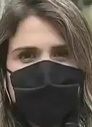
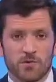
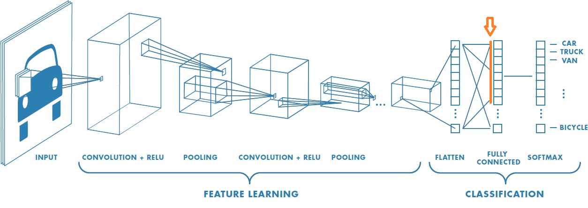

# El práctico

Esta competencia ha sido creada a partir de un datasets sobre una recopilación de videos de personas utilizando protectores buconasales (barbijos). El objetivo es determinar si las personas tienen puesto los barbijos a partir de las imágenes.

Este conjunto de datos fue elaborado utilizando 11 diferentes videos disponibles en la plataforma YouTube, en donde se muestran personas utilizando máscaras de protección en diversas situaciones y entornos: videos de trabajadores en las industrias, personas en la vı́a pública, entrevistas a personas y niños en las escuelas. Este conjunto está compuesto por imágenes con 1 261 caras con protectores buconasal y 993 caras sin ellos.

A cada imagen se la procesó mediante una red convolucional [ResNET101](https://arxiv.org/abs/1512.03385) para obtener la características sobresalientes adecuadas para realizar la tarea de clasificación de imágenes.

## Atributos del dataset:

El conjunto de datos contiene exclusivamente los siguientes atributos:

| Atributo     | Descripción |
|--------------|-------------|
| `Id`         | Identificador único de la imagen. |
| `Clase`      | Etiqueta objetivo: `ccb` (cara con barbijo) o `csb` (cara sin barbijo). |
| `bb_width`   | Ancho del recorte de la cara (bounding box). |
| `bb_height`  | Alto del recorte de la cara. |
| `ch_RGB`     | Promedio del histograma de los tres canales de color RGB. |
| `1097, 595, ...` | Vector de características numéricas extraído por la red convolucional. |

## Requerimientos del práctico

1. Realizar un análisis exploratorio de datos, y utilizar lo aprendido para generar su mejor modelo.
1. Superar el puntaje del baseline (público) en la competencia kaggle.
1. Usar al menos 3 modelos distintos al del árbol de decisión que se explora como baseline (se puede explorar más profundamente el árbol de decisión, pero aún así deberán explorar otros modelos).
1. Entregar un notebook con el análisis exploratorio de datos y el código con los 3 mejores modelos entregados en la competencia (de acuerdo a los resultados obtenidos).

## Pasos a seguir

1. Crear una cuenta en kaggle.com.
1. Sumarse a la competencia. El link está disponible en la UV de la materia.
    * Hacer click en "Join Competition".
    * Aceptar las reglas.
1. Crear un equipo (Team): El trabajo se evaluará en los grupos asignados.
1. Pueden descargar los datos (Data), aunque también están incluidos en este repo.
1. Una vez realizada una predicción (ver ejemplo abajo), subir los resultados a kaggle haciendo click en "Submit Predictions" en la página principal de la competencia. Ahí deberán subir el archivo csv generado y describir (para sus registros) qué están subiendo.

## Un ejemplo

Adjuntamos una implementación que tiene por objetivo:

* Levantar los datos que usaremos.
* Analizar de una manera simple los datos.
* Preparar los datos para procesarlos con un modelo en particular.
* Crear un *baseline* para la competencia.
* Generar el archivo que se subirá a kaggle para su evaluación.

## Subir una predicción a Kaggle

En el ejemplo de baseline que se entrega, se genera un archivo en el path *data/submission.csv*. Tal archivo es un csv con un formato en particular, que asigna a números de visita en el conjunto de test, una predicción de si fue teletransportado o no a otra dimensión alternativa.
Ese archivo debe ser subido a kaggle como lo explicamos arriba: haciendo click en "Submit Predictions" en la página principal de la competencia.

## Algunas consideraciones

* En el baseline solo se utiliza cross-validation (mediante *GridSearchCV*) para evaluar el modelo, son libres de generar un subconjunto de validación aparte del conjunto de entrenamiento si así lo desean.
* Los *features* escogidos no tienen ningún análisis y son casi por defecto. Parte del proceso de encontrar un buen modelo es ver como trabajar dichos features.
* La métrica a optimizar será el recall score.
